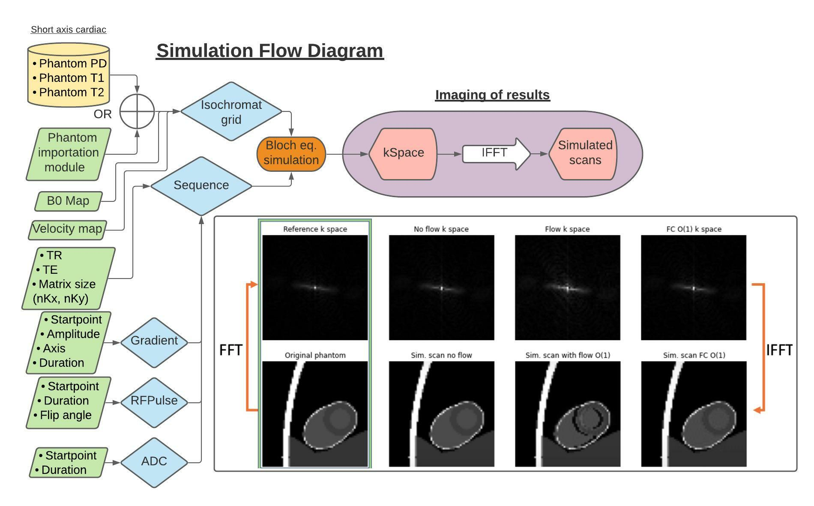

# E-MaRSSim
Open-source educational MRI pulse sequence simulation tool

This notebook contains a simple MRI simulator which can be used to define a custom pulse sequence and simulate an image acquisition on a phantom. During this tutorial we will simulate a spoiled GRE sequence on a cardiac phantom and we will observe the effects of blood flow.

Numerical simulations are an immediate, flexible and accessible tool for understanding the fundamentals of MRI physics. 
Several open-source tools have been proposed recently, which provide comprehensive simulation environments. However, the core of the simulation software is hidden from the final users, who often interact only with the graphical user-interface. With this work, we propose a Python-based, hands-on, fully customizable open-source MRI pulse sequence simulation framework for educational purposes. The aim is to provide an easy-to-use simulation tool, with minimal computational hardware requirements, to facilitate the practical study of MRI basic principles.

The simulation framework is based on Python and can be operated across platforms using Google Colab notebooks. The simulation workflow is illustrated in the figure below. Voxel wise tissue properties (PD, T1, T2) can be imported from custom images, and serve to simulate a grid of isochromats. Other supported inputs are phantom flow velocity and acceleration maps (Fig. 1), as well as a B0 map. The pulse sequence is defined by calculating the traces for the RF pulses, the gradients Gx, Gy, and Gz, and the ADC. Users can freely adjust the strength, timing and shape of gradient element to implement their custom sequence diagram. Bloch simulations are then performed on the isochromat grids, including relaxation and off-resonance effects. Finally, the fully sampled, simulated image is reconstructed using inverse FFT. For a demonstration of the simulator functionalities, two built-in pulse sequences can be chosen: a gradient-echo and a spin-echo sequence. The notebook can be retrieved from and used in Google Colab via the following link:

